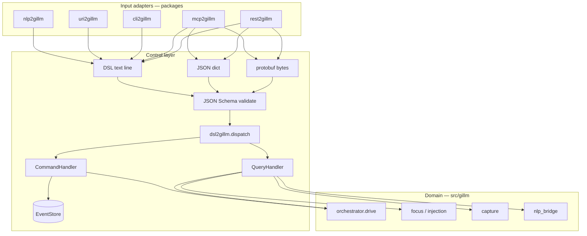

# gillm

**GUI Control Plugin with NLP & Intent Contracts**

Sterowanie GUI przez DSL, NLP i wiele adapterów wejścia (CLI, REST, MCP, URI). Domena (focus, inject, capture, orchestrator) żyje w `src/gillm/`; warstwa kontroli w `packages/*2gillm`.

   

## AI Cost Tracking

   
  

- 🤖 **LLM usage:** $2.6237 (12 commits)
- 👤 **Human dev:** ~$894 (8.9h @ $100/h, 30min dedup)

Generated on 2026-06-08 using [openrouter/qwen/qwen3-coder-next](https://openrouter.ai/qwen/qwen3-coder-next)

---

## Contents

- [Architecture](#architecture)
- [Control layer packages](#control-layer-packages)
- [Installation](#installation)
- [Quick start](#quick-start)
- [DSL verbs](#dsl-verbs)
- [CLI](#cli)
- [REST API](#rest-api)
- [Environment variables](#environment-variables)
- [Testing](#testing)
- [Project layout](#project-layout)
- [Documentation](#documentation)
- [License](#license)

## Architecture

```
SUMD (description) → DOQL/source (code) → taskfile (automation) → testql (verification)
```

Sources: [`SUMD.md`](SUMD.md) · [`app.doql.less`](app.doql.less) · [`Makefile`](Makefile)



Jedyny punkt mutacji w warstwie kontroli: `dsl2gillm.dispatch()`.

## Control layer packages

| Package | Role | Docs |
|---------|------|------|
| **dsl2gillm** | DSL grammar, JSON Schema, Protobuf, CQRS bus, EventStore | [README](packages/dsl2gillm/README.md) |
| **uri2gillm** | `gillm://` URI → DSL line → `dispatch()` | [README](packages/uri2gillm/README.md) |
| **nlp2gillm** | Natural language → DSL (`to-dsl`); `apply` = dispatch | [README](packages/nlp2gillm/README.md) |
| **cli2gillm** | Shell REPL / exec / run | [README](packages/cli2gillm/README.md) |
| **mcp2gillm** | MCP stdio (`gillm_run_command`, `gillm_run_command_pb`, …) | [README](packages/mcp2gillm/README.md) |
| **rest2gillm** | FastAPI `/v1/dsl`, default port **8220** | [README](packages/rest2gillm/README.md) |

Overview: [`packages/README.md`](packages/README.md).

## Installation

**Runtime** (core GUI domain only):

```bash
pip install -e .
# or: make install
```

**Development** (control layer + test tooling):

```bash
bash packages/install-dev.sh
# or: pip install -e ".[dev]"
# or: make dev-install
```

Optional control extras without full dev stack:

```bash
pip install -e ".[control]"
```

Requires **Python ≥ 3.10**.

## Quick start

```bash
# Schema + dry-run workflow (no real GUI)
dsl2gillm validate-schema
gillm run fixtures/workflow.json --dry-run
gillm run fixtures/workflow-dry.json --dry-run

# NLP → DSL
nlp2gillm to-dsl "check health"

# REST smoke test (separate terminal)
rest2gillm serve --port 8220
curl http://127.0.0.1:8220/health
curl -X POST http://127.0.0.1:8220/v1/dsl -d 'HEALTH'
```

## DSL verbs

| Type | Verbs |
|------|-------|
| Query | `HEALTH`, `ORIENT`, `PARSE`, `ACTIONS`, `VALIDATE`, `RESOLVE`, `CAPTURE` |
| Command | `EXECUTE`, `SIMULATE`, `FOCUS`, `INJECT` |

Example lines:

```text
HEALTH
ORIENT
ACTIONS
PARSE "focus vscode and type hello"
VALIDATE STEPS [{"action":"wait","config":{"seconds":0.01}}]
RESOLVE "capture screen"
CAPTURE SCALE 0.2
EXECUTE FILE workflow.json
SIMULATE FILE workflow.json
FOCUS HINTS vscode,cursor
INJECT "hello" IDE default
```

Generate Pydantic models from JSON schemas:

```bash
python -m dsl2gillm.codegen
# or: dsl2gillm codegen
```

## CLI

| Entry point | Purpose | Docs |
|-------------|---------|------|
| `gillm` | Legacy CLI: `run`, `nlp`, `capture` (delegates to `dsl2gillm.dispatch`) | [README](README.md#cli) |
| `dsl2gillm` | DSL bus: `-c 'HEALTH'`, `validate-schema`, `codegen`, protobuf codecs | [README](packages/dsl2gillm/README.md) |
| `nlp2gillm` | NL → DSL translation | [README](packages/nlp2gillm/README.md) |
| `uri2gillm` | `gillm://` URI resolution | [README](packages/uri2gillm/README.md) |
| `cli2gillm` | Interactive shell | [README](packages/cli2gillm/README.md) |
| `mcp2gillm` | MCP server | [README](packages/mcp2gillm/README.md) |
| `rest2gillm` | FastAPI server (`serve --port 8220`) | [README](packages/rest2gillm/README.md) |

```bash
gillm run fixtures/workflow-dry.json --dry-run
gillm nlp "focus vscode and type hello" --dry-run
gillm capture --scale 0.2
dsl2gillm -c 'HEALTH'
```

## REST API

`GET /` returns an endpoint map. Default base URL: `http://127.0.0.1:8220/`.

```bash
rest2gillm serve --port 8220
curl http://127.0.0.1:8220/
curl http://127.0.0.1:8220/health
curl -X POST http://127.0.0.1:8220/v1/dsl -d 'HEALTH'
```

## Environment variables

Copy `.env.example` to `.env` for local development.

| Variable | Default | Description |
|----------|---------|-------------|
| `OPENROUTER_API_KEY` | *(not set)* | OpenRouter API key ([keys](https://openrouter.ai/keys)) |
| `LLM_MODEL` | `openrouter/qwen/qwen3-coder-next` | LLM model for NLP / pfix |
| `PFIX_AUTO_APPLY` | `true` | Apply fixes without asking |
| `PFIX_AUTO_INSTALL_DEPS` | `true` | Auto `pip`/`uv` install |
| `PFIX_AUTO_RESTART` | `false` | Restart process after fix |
| `PFIX_MAX_RETRIES` | `3` | Max self-heal retries |
| `PFIX_DRY_RUN` | `false` | Dry-run mode |
| `PFIX_ENABLED` | `true` | Enable pfix |
| `PFIX_GIT_COMMIT` | `false` | Auto-commit fixes |
| `PFIX_GIT_PREFIX` | `pfix:` | Commit message prefix |
| `PFIX_CREATE_BACKUPS` | `false` | Disable `.pfix_backups/` |

GUI injection (Wayland/X11) also reads `KORU_*` variables — see [`SUMD.md`](SUMD.md) for the full list (`KORU_OS_INJECTOR`, `KORU_INJECTOR_BACKEND`, `WAYLAND_DISPLAY`, `DISPLAY`, …).

## Testing

**Core domain** (`src/gillm`):

```bash
python -m pytest tests/ -q
# or: make test
```

Main modules:

- `tests/test_injector.py` — `gillm.injection.injector.Injector` (keyboard backends: xdotool/ydotool/wtype)
- `tests/test_os_injector.py` — calibrated profiles under `~/.koru/ide-os-injector.json`
- `tests/test_gui_driver.py`, `tests/test_drive_backend.py`, `tests/test_recovery.py`

**Control layer** (`packages/*2gillm`):

```bash
python -m pytest packages/dsl2gillm/tests packages/uri2gillm/tests packages/nlp2gillm/tests \
       packages/cli2gillm/tests packages/mcp2gillm/tests packages/rest2gillm/tests -q
```

Makefile shortcuts: `make test-fast`, `make test-unit`, `make test-integration`, `make test-slow`.

Koru keeps integration tests only (daemon wire protocol, IDE shims, CLI). Do not re-add duplicate injector unit tests under `koru/tests/`.

## Project layout

```
gillm/
├── src/gillm/          # GUI domain: focus, injection, capture, orchestrator, recovery
├── packages/           # Control adapters: dsl2gillm, uri2gillm, nlp2gillm, cli2gillm, mcp2gillm, rest2gillm
├── tests/              # Domain unit tests
├── fixtures/           # Workflow JSON for dry-run smoke tests
├── app.doql.less       # DOQL application declaration
├── SUMD.md             # Structured Unified Markdown Descriptor (full project spec)
└── pyproject.toml
```

## Documentation

| Document | Purpose |
|----------|---------|
| [README.md](README.md) | User guide (this file) |
| [SUMD.md](SUMD.md) | Full Structured Unified Markdown Descriptor — DOQL, interfaces, env vars, call graph, test contracts |
| [SUMR.md](SUMR.md) | Compact SUMD for refactoring (call graph, duplication, evolution) |
| [packages/README.md](packages/README.md) | Control layer architecture, smoke tests, DSL verbs |
| [app.doql.less](app.doql.less) | DOQL application declaration (source of truth for entities/workflows) |
| [CHANGELOG.md](CHANGELOG.md) | Release history |
| [project/README.md](project/README.md) | Generated code analysis artifacts (`*.toon.yaml`, Mermaid) |
| [project/context.md](project/context.md) | LLM-ready architecture narrative |
| [packages/CONTROL_LAYER_PROMPT.template.md](packages/CONTROL_LAYER_PROMPT.template.md) | Template for extending `*2gillm` adapters |

Per-package docs: [dsl2gillm](packages/dsl2gillm/README.md) · [uri2gillm](packages/uri2gillm/README.md) · [nlp2gillm](packages/nlp2gillm/README.md) · [cli2gillm](packages/cli2gillm/README.md) · [mcp2gillm](packages/mcp2gillm/README.md) · [rest2gillm](packages/rest2gillm/README.md)

## License

Licensed under Apache-2.0.
