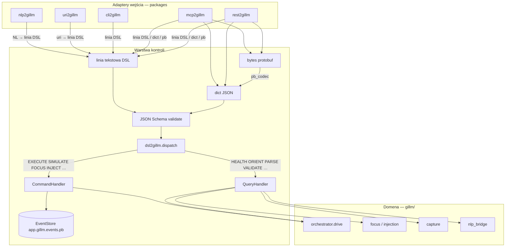

# Gillm control layers (`*2gillm`)

Warstwa kontroli według [`CONTROL_LAYER_PROMPT.template.md`](CONTROL_LAYER_PROMPT.template.md) (referencja: `doql`, `nlp2dsl`, `koru`).

**See also:** [README.md](../README.md) (user guide) · [SUMD.md](../SUMD.md) (full spec) · [SUMR.md](../SUMR.md) (refactor view) · [app.doql.less](../app.doql.less) (DOQL manifest)

## Paczki

| Pakiet | Rola | Docs |
|--------|------|------|
| **dsl2gillm** | DSL + JSON Schema + Protobuf + CQRS bus + EventStore | [README](dsl2gillm/README.md) |
| **uri2gillm** | `gillm://` → linia DSL → `dispatch()` | [README](uri2gillm/README.md) |
| **nlp2gillm** | NL → DSL (`to-dsl`); `apply` = dispatch | [README](nlp2gillm/README.md) |
| **cli2gillm** | Shell REPL / exec / run | [README](cli2gillm/README.md) |
| **mcp2gillm** | MCP stdio (`gillm_run_command`, `gillm_run_command_pb`, …) | [README](mcp2gillm/README.md) |
| **rest2gillm** | FastAPI `/v1/dsl`, port **8220** | [README](rest2gillm/README.md) |

Domena GUI (focus, inject, capture, orchestrator) pozostaje w `src/gillm/` — adaptery są cienkimi mostami.



## Instalacja (dev)

Z katalogu głównego repozytorium (`install-dev.sh` jest tylko tutaj, nie w `goal/`):

```bash
bash packages/install-dev.sh
```

## Szybki smoke test

Fixture'y (`fixtures/`) są tylko w katalogu głównym repozytorium:

```bash
dsl2gillm validate-schema
gillm run fixtures/workflow.json --dry-run
gillm run fixtures/workflow-dry.json --dry-run   # focus+inject offline
nlp2gillm to-dsl "check health"
```

Z innego katalogu użyj ścieżki absolutnej do fixture'a.

## REST (port 8220)

`GET /` zwraca mapę endpointów. Przeglądarka na `http://127.0.0.1:8220/` nie powinna dawać 404.

```bash
curl http://127.0.0.1:8220/
curl http://127.0.0.1:8220/health
curl -X POST http://127.0.0.1:8220/v1/dsl -d 'HEALTH'
```

## Testy

```bash
python3 -m pytest packages/dsl2gillm/tests packages/uri2gillm/tests packages/nlp2gillm/tests \
       packages/cli2gillm/tests packages/mcp2gillm/tests packages/rest2gillm/tests -q
```

## DSL gillm (runtime / GUI)

```text
HEALTH
ORIENT
ACTIONS
PARSE "focus vscode and type hello"
VALIDATE STEPS [{"action":"wait","config":{"seconds":0.01}}]
RESOLVE "capture screen"
CAPTURE SCALE 0.2
EXECUTE FILE workflow.json
SIMULATE FILE workflow.json
FOCUS HINTS vscode,cursor
INJECT "hello" IDE default
```

## Verby

| Typ | Verby |
|-----|-------|
| Query | `HEALTH`, `ORIENT`, `PARSE`, `ACTIONS`, `VALIDATE`, `RESOLVE`, `CAPTURE` |
| Command | `EXECUTE`, `SIMULATE`, `FOCUS`, `INJECT` |

## Codegen (Faza 5)

```bash
python -m dsl2gillm.codegen
# lub: dsl2gillm codegen
```

Generuje `dsl2gillm/models.py` (pydantic) ze schem JSON.

## Legacy CLI

`gillm run` / `gillm nlp` / `gillm capture` delegują do `dsl2gillm.dispatch()` (PARSE → EXECUTE/SIMULATE dla `nlp`). Szczegóły: [README.md](../README.md#cli).

## Domena GUI

Moduły `src/gillm/` (focus, injection, capture, orchestrator, recovery) — testy w [`tests/`](../tests/). Integracja z Koru: [`src/gillm/adapters/koru.py`](../src/gillm/adapters/koru.py).
