# System Architecture Analysis
<!-- generated in 0.00s -->

## Overview

- **Project**: /home/tom/github/semcod/gillm
- **Primary Language**: python
- **Languages**: python: 43, yaml: 2, shell: 2, toml: 1
- **Analysis Mode**: static
- **Total Functions**: 188
- **Total Classes**: 33
- **Modules**: 49
- **Entry Points**: 114

## Architecture by Module

### src.gillm.injection.injector
- **Functions**: 18
- **Classes**: 3
- **File**: `injector.py`

### src.gillm.injection.backends
- **Functions**: 11
- **File**: `backends.py`

### src.gillm.focus.wayland
- **Functions**: 11
- **Classes**: 1
- **File**: `wayland.py`

### src.gillm.contracts.driver
- **Functions**: 11
- **Classes**: 7
- **File**: `driver.py`

### src.gillm.injection.os_injector
- **Functions**: 10
- **File**: `os_injector.py`

### src.gillm.runtime.env
- **Functions**: 10
- **File**: `env.py`

### src.gillm.runtime.profiles
- **Functions**: 9
- **Classes**: 1
- **File**: `profiles.py`

### src.gillm.config
- **Functions**: 8
- **Classes**: 1
- **File**: `config.py`

### src.gillm.focus.x11
- **Functions**: 8
- **Classes**: 1
- **File**: `x11.py`

### src.gillm.orchestrator.drive
- **Functions**: 8
- **Classes**: 1
- **File**: `drive.py`

### src.gillm.drivers.composite
- **Functions**: 8
- **Classes**: 1
- **File**: `composite.py`

### src.gillm.drivers.dry_run
- **Functions**: 8
- **Classes**: 1
- **File**: `dry_run.py`

### src.gillm.runtime.backend_selector
- **Functions**: 8
- **Classes**: 1
- **File**: `backend_selector.py`

### src.gillm.focus.strategy
- **Functions**: 7
- **Classes**: 5
- **File**: `strategy.py`

### src.gillm.runtime.command_runner
- **Functions**: 7
- **Classes**: 1
- **File**: `command_runner.py`

### src.gillm.capture.mss_backend
- **Functions**: 6
- **Classes**: 1
- **File**: `mss_backend.py`

### src.gillm.focus.darwin
- **Functions**: 5
- **Classes**: 1
- **File**: `darwin.py`

### src.gillm.recovery.diagnose
- **Functions**: 5
- **Classes**: 2
- **File**: `diagnose.py`

### src.gillm.runtime.activity
- **Functions**: 5
- **File**: `activity.py`

### src.gillm.focus.registry
- **Functions**: 4
- **File**: `registry.py`

## Key Entry Points

Main execution flows into the system:

### src.gillm.adapters.koru.drive_payload_to_action_plan
> Convert a structured Koru/gillm drive payload into an ActionPlan.
- **Calls**: str, str, isinstance, str, bool, ActionPlan, isinstance, payload.get

### src.gillm.cli.main.main
- **Calls**: argparse.ArgumentParser, parser.add_subparsers, subparsers.add_parser, run_parser.add_argument, run_parser.add_argument, subparsers.add_parser, nlp_parser.add_argument, nlp_parser.add_argument

### src.gillm.drivers.composite.CompositeGuiDriver.execute
- **Calls**: next, ExecutionOutcome, str, steps.append, self.focus, src.gillm.recovery.diagnose.classify_failure, DriveFailureContext, src.gillm.recovery.repair_hints.recovery_hints_for_context

### src.gillm.recovery.diagnose.diagnose_drive_reply
> Map a Koru/gillm drive ack or error dict to structured recovery context.
- **Calls**: bool, str, str, reply.get, reply.get, isinstance, src.gillm.recovery.diagnose.classify_failure, src.gillm.recovery.diagnose.probe_environment

### src.gillm.orchestrator.drive.DriveOrchestrator.execute_step
> Execute a single workflow step.

# @intract.v1 scope:method intent:execute:step priority:3 domain:gui input:step,dry_run output:result effect:execute_
- **Calls**: step.get, self.log, step.get, config.get, isinstance, tuple, self.focus_target_window, config.get

### src.gillm.drivers.composite.CompositeGuiDriver.type_text
- **Calls**: src.gillm.runtime.profiles.try_load_profile, ActionResult, ActionResult, self._injector.type_text, src.gillm.injection.os_injector.inject_with_profile, ActionResult, ActionResult, bool

### src.gillm.injection.injector.Injector.submit_only
> Press only the IDE submit key via the selected backend.
- **Calls**: self._candidate_backends, src.gillm.injection.injector._submit_key_for, InjectorError, InjectorError, self.log, InjectionResult, self.log, self._type_with_backend

### src.gillm.focus.x11.X11LinuxStrategy.capabilities
- **Calls**: shutil.which, shutil.which, shutil.which, OsCapabilities, focus_methods.append, focus_methods.append, shutil.which, bool

### src.gillm.focus.wayland.WaylandLinuxStrategy.capabilities
- **Calls**: shutil.which, self._term_program_is_vscode_family, shutil.which, OsCapabilities, focus_methods.append, focus_methods.append, shutil.which, bool

### src.gillm.drivers.dry_run.DryRunGuiDriver.execute
- **Calls**: ExecutionOutcome, str, steps.append, self.focus, ExecutionOutcome, step.get, self.type_text, str

### src.gillm.focus.x11.X11LinuxStrategy._focus_via_xdotool
- **Calls**: shutil.which, src.gillm.focus.x11._run, src.gillm.focus.x11._run, src.gillm.focus.x11._run, line.strip, time.sleep, proc.stdout.strip, proc.stdout.strip

### src.gillm.focus.wayland.WaylandLinuxStrategy._inject_via_ydotool
- **Calls**: src.gillm.focus.wayland._scan_for_key, argv.append, argv.append, reversed, src.gillm.focus.wayland._scan_for_key, codes.append, argv.append, argv.append

### src.gillm.injection.injector.Injector._call
- **Calls**: self.runner, None.join, self.log, None.strip, InjectorError, self.log, self.log, None.decode

### src.gillm.injection.os_injector.try_drive_with_profile
- **Calls**: src.gillm.injection.os_injector._os_injector_skip_reason, src.gillm.runtime.profiles.try_load_profile, src.gillm.injection.os_injector.inject_with_profile, src.gillm.runtime.env.os_injector_env_forced, src.gillm.runtime.activity.emit_activity_warn, src.gillm.injection.backends._log, src.gillm.runtime.env.dry_run_from_env, src.gillm.injection.backends._log

### src.gillm.focus.x11.X11LinuxStrategy.matches_current_environment
- **Calls**: None.strip, bool, None.lower, None.strip, os.environ.get, None.strip, os.environ.get, os.environ.get

### src.gillm.focus.wayland.WaylandLinuxStrategy.inject_keys
- **Calls**: bool, bool, src.gillm.focus.wayland._prefer_ydotool, shutil.which, shutil.which, self._inject_via_ydotool, self._inject_via_wtype, self._inject_via_ydotool

### src.gillm.injection.injector.Injector._try_type_text_backends
- **Calls**: self._all_type_backends_failed, InjectionResult, self.log, self._type_with_backend, self.log, errors.append, self.log, len

### src.gillm.injection.injector.Injector.type_text
> Type ``text`` and optionally press the IDE's submit key.
- **Calls**: self._log_type_text_request, self._type_text_backends, self._try_type_text_backends, InjectorError, src.gillm.injection.injector._submit_key_for, self.log, self._dry_run_type_text_result, len

### src.gillm.injection.drive_backend.format_os_injector_ack
> Build ack payload fields from an OS injector result dict.
- **Calls**: os_res.get, os_res.get, isinstance, str, bool, os_res.get, os_res.get

### src.gillm.focus.wayland.WaylandLinuxStrategy._inject_via_wtype
- **Calls**: src.gillm.focus.x11._run, None.lower, argv.extend, argv.extend, len, argv.extend, argv.extend

### src.gillm.drivers.composite.CompositeGuiDriver.hotkey
- **Calls**: ActionResult, ActionResult, self._injector.submit_only, ActionResult, ActionResult, str, None.join

### src.gillm.runtime.profiles.save_profile
- **Calls**: None.resolve, path.parent.mkdir, path.write_text, path.exists, src.gillm.runtime.profiles._read_json, json.dumps, src.gillm.runtime.profiles.default_config_path

### src.gillm.nlp_bridge.client.NLPBridgeClient.parse_intent
> Parse natural language command into structured workflow steps.

# @intract.v1 scope:method intent:nlp:parse priority:3 domain:nlp input:text output:st
- **Calls**: self.client.workflow_from_text, res.get, NLP2DSLClient, fallback_client.workflow_from_text, res.get, RuntimeError

### src.gillm.focus.darwin.DarwinStrategy.capabilities
- **Calls**: shutil.which, shutil.which, OsCapabilities, bool, bool, shutil.which

### src.gillm.drivers.composite.CompositeGuiDriver.focus
- **Calls**: src.gillm.runtime.profiles.try_load_profile, ActionResult, ActionResult, src.gillm.injection.os_injector.focus_with_profile, ActionResult, str

### src.gillm.runtime.backend_selector.BackendSelector.candidate_backends
- **Calls**: src.gillm.runtime.env.forced_injector_backend, self._available_backend_candidates, self._forced_backend_candidates, self.log, src.gillm.runtime.backend_selector.session_backend_order, self.log

### src.gillm.runtime.command_runner.set_clipboard
- **Calls**: text.encode, shutil.which, shutil.which, OsInjectorError, src.gillm.runtime.command_runner.run_cmd_checked, src.gillm.runtime.command_runner.run_cmd_checked

### src.gillm.focus.x11.X11LinuxStrategy.focus_window
- **Calls**: self._focus_via_xdotool, self._focus_via_wmctrl, FocusOutcome, FocusOutcome, FocusOutcome

### src.gillm.focus.x11.X11LinuxStrategy.inject_keys
- **Calls**: shutil.which, shutil.which, self._inject_via_xdotool, None.inject_keys, WaylandLinuxStrategy

### src.gillm.focus.wayland.WaylandLinuxStrategy.matches_current_environment
- **Calls**: None.strip, None.lower, os.environ.get, None.strip, os.environ.get

## Process Flows

Key execution flows identified:

### Flow 1: drive_payload_to_action_plan
```
drive_payload_to_action_plan [src.gillm.adapters.koru]
```

### Flow 2: main
```
main [src.gillm.cli.main]
```

### Flow 3: execute
```
execute [src.gillm.drivers.composite.CompositeGuiDriver]
```

### Flow 4: diagnose_drive_reply
```
diagnose_drive_reply [src.gillm.recovery.diagnose]
```

### Flow 5: execute_step
```
execute_step [src.gillm.orchestrator.drive.DriveOrchestrator]
```

### Flow 6: type_text
```
type_text [src.gillm.drivers.composite.CompositeGuiDriver]
  └─ →> try_load_profile
      └─> iter_config_paths
      └─> load_profile
          └─> _read_json
  └─ →> inject_with_profile
      └─> _resolve_input_method
          └─ →> input_mode_from_env
      └─> _focus_profile_chat
```

### Flow 7: submit_only
```
submit_only [src.gillm.injection.injector.Injector]
  └─ →> _submit_key_for
      └─ →> cached_config
          └─> _cached_config
```

### Flow 8: capabilities
```
capabilities [src.gillm.focus.x11.X11LinuxStrategy]
```

### Flow 9: _focus_via_xdotool
```
_focus_via_xdotool [src.gillm.focus.x11.X11LinuxStrategy]
  └─ →> _run
  └─ →> _run
```

### Flow 10: _inject_via_ydotool
```
_inject_via_ydotool [src.gillm.focus.wayland.WaylandLinuxStrategy]
  └─ →> _scan_for_key
  └─ →> _scan_for_key
```

## Key Classes

### src.gillm.injection.injector.Injector
> Pick the best available backend and type text through it.
- **Methods**: 12
- **Key Methods**: src.gillm.injection.injector.Injector.probe, src.gillm.injection.injector.Injector._candidate_backends, src.gillm.injection.injector.Injector.select_backend, src.gillm.injection.injector.Injector._type_with_backend, src.gillm.injection.injector.Injector._type_text_backends, src.gillm.injection.injector.Injector._log_type_text_request, src.gillm.injection.injector.Injector._dry_run_type_text_result, src.gillm.injection.injector.Injector._try_type_text_backends, src.gillm.injection.injector.Injector._all_type_backends_failed, src.gillm.injection.injector.Injector.type_text

### src.gillm.drivers.dry_run.DryRunGuiDriver
> Records actions without touching the OS.
- **Methods**: 9
- **Key Methods**: src.gillm.drivers.dry_run.DryRunGuiDriver.__init__, src.gillm.drivers.dry_run.DryRunGuiDriver.log, src.gillm.drivers.dry_run.DryRunGuiDriver.probe, src.gillm.drivers.dry_run.DryRunGuiDriver.focus, src.gillm.drivers.dry_run.DryRunGuiDriver.type_text, src.gillm.drivers.dry_run.DryRunGuiDriver.hotkey, src.gillm.drivers.dry_run.DryRunGuiDriver.click, src.gillm.drivers.dry_run.DryRunGuiDriver.screenshot, src.gillm.drivers.dry_run.DryRunGuiDriver.execute

### src.gillm.focus.strategy.OsStrategy
> Per-OS knowledge object.
- **Methods**: 8
- **Key Methods**: src.gillm.focus.strategy.OsStrategy.id, src.gillm.focus.strategy.OsStrategy.label, src.gillm.focus.strategy.OsStrategy.matches_current_environment, src.gillm.focus.strategy.OsStrategy.capabilities, src.gillm.focus.strategy.OsStrategy.focus_window, src.gillm.focus.strategy.OsStrategy.inject_keys, src.gillm.focus.strategy.OsStrategy._term_program_is_vscode_family, src.gillm.focus.strategy.OsStrategy.__repr__
- **Inherits**: ABC

### src.gillm.orchestrator.drive.DriveOrchestrator
> Consolidated orchestrator for GUI drive tasks.
- **Methods**: 8
- **Key Methods**: src.gillm.orchestrator.drive.DriveOrchestrator.__init__, src.gillm.orchestrator.drive.DriveOrchestrator.log, src.gillm.orchestrator.drive.DriveOrchestrator.focus_target_window, src.gillm.orchestrator.drive.DriveOrchestrator.inject_text, src.gillm.orchestrator.drive.DriveOrchestrator.capture_screenshot, src.gillm.orchestrator.drive.DriveOrchestrator.execute_step, src.gillm.orchestrator.drive.DriveOrchestrator.execute_workflow, src.gillm.orchestrator.drive.DriveOrchestrator.drive_natural_language

### src.gillm.drivers.composite.CompositeGuiDriver
> Production GuiDriver backed by Injector + os_injector profiles.
- **Methods**: 8
- **Key Methods**: src.gillm.drivers.composite.CompositeGuiDriver.__init__, src.gillm.drivers.composite.CompositeGuiDriver.probe, src.gillm.drivers.composite.CompositeGuiDriver.focus, src.gillm.drivers.composite.CompositeGuiDriver.type_text, src.gillm.drivers.composite.CompositeGuiDriver.hotkey, src.gillm.drivers.composite.CompositeGuiDriver.click, src.gillm.drivers.composite.CompositeGuiDriver.screenshot, src.gillm.drivers.composite.CompositeGuiDriver.execute

### src.gillm.focus.x11.X11LinuxStrategy
- **Methods**: 7
- **Key Methods**: src.gillm.focus.x11.X11LinuxStrategy.matches_current_environment, src.gillm.focus.x11.X11LinuxStrategy.capabilities, src.gillm.focus.x11.X11LinuxStrategy.focus_window, src.gillm.focus.x11.X11LinuxStrategy.inject_keys, src.gillm.focus.x11.X11LinuxStrategy._focus_via_xdotool, src.gillm.focus.x11.X11LinuxStrategy._focus_via_wmctrl, src.gillm.focus.x11.X11LinuxStrategy._inject_via_xdotool
- **Inherits**: StaticOsIdentityMixin, OsStrategy

### src.gillm.focus.wayland.WaylandLinuxStrategy
- **Methods**: 7
- **Key Methods**: src.gillm.focus.wayland.WaylandLinuxStrategy.matches_current_environment, src.gillm.focus.wayland.WaylandLinuxStrategy.capabilities, src.gillm.focus.wayland.WaylandLinuxStrategy.focus_window, src.gillm.focus.wayland.WaylandLinuxStrategy.inject_keys, src.gillm.focus.wayland.WaylandLinuxStrategy._focus_via_wmctrl, src.gillm.focus.wayland.WaylandLinuxStrategy._inject_via_wtype, src.gillm.focus.wayland.WaylandLinuxStrategy._inject_via_ydotool
- **Inherits**: StaticOsIdentityMixin, OsStrategy

### src.gillm.contracts.driver.GuiDriver
> Stable GUI control surface for orchestrators (Koru, CLI, tests).
- **Methods**: 7
- **Key Methods**: src.gillm.contracts.driver.GuiDriver.probe, src.gillm.contracts.driver.GuiDriver.focus, src.gillm.contracts.driver.GuiDriver.type_text, src.gillm.contracts.driver.GuiDriver.hotkey, src.gillm.contracts.driver.GuiDriver.click, src.gillm.contracts.driver.GuiDriver.screenshot, src.gillm.contracts.driver.GuiDriver.execute
- **Inherits**: Protocol

### src.gillm.runtime.backend_selector.BackendSelector
> Pick keyboard injection backends for the current session.
- **Methods**: 6
- **Key Methods**: src.gillm.runtime.backend_selector.BackendSelector.__init__, src.gillm.runtime.backend_selector.BackendSelector.candidate_backends, src.gillm.runtime.backend_selector.BackendSelector.select_backend, src.gillm.runtime.backend_selector.BackendSelector._forced_backend_candidates, src.gillm.runtime.backend_selector.BackendSelector._available_backend_candidates, src.gillm.runtime.backend_selector.BackendSelector.probe

### src.gillm.focus.darwin.DarwinStrategy
- **Methods**: 4
- **Key Methods**: src.gillm.focus.darwin.DarwinStrategy.matches_current_environment, src.gillm.focus.darwin.DarwinStrategy.capabilities, src.gillm.focus.darwin.DarwinStrategy.focus_window, src.gillm.focus.darwin.DarwinStrategy.inject_keys
- **Inherits**: StaticOsIdentityMixin, OsStrategy

### src.gillm.focus.windows.WindowsStrategy
- **Methods**: 4
- **Key Methods**: src.gillm.focus.windows.WindowsStrategy.matches_current_environment, src.gillm.focus.windows.WindowsStrategy.capabilities, src.gillm.focus.windows.WindowsStrategy.focus_window, src.gillm.focus.windows.WindowsStrategy.inject_keys
- **Inherits**: StaticOsIdentityMixin, OsStrategy

### src.gillm.nlp_bridge.client.NLPBridgeClient
> Bridge to nlp2dsl backend for resolving natural language GUI commands.
- **Methods**: 2
- **Key Methods**: src.gillm.nlp_bridge.client.NLPBridgeClient.__init__, src.gillm.nlp_bridge.client.NLPBridgeClient.parse_intent

### src.gillm.focus.strategy.StaticOsIdentityMixin
> Provide ``id``/``label`` from class-level constants.
- **Methods**: 2
- **Key Methods**: src.gillm.focus.strategy.StaticOsIdentityMixin.id, src.gillm.focus.strategy.StaticOsIdentityMixin.label

### src.gillm.config.AutopilotConfig
> In-memory view of ``autopilot.toml`` (or defaults).
- **Methods**: 1
- **Key Methods**: src.gillm.config.AutopilotConfig.submit_key_for

### src.gillm.focus.strategy.KeySequence
> Portable key sequence description used by :meth:`OsStrategy.inject_keys`.
- **Methods**: 1
- **Key Methods**: src.gillm.focus.strategy.KeySequence.__post_init__

### src.gillm.recovery.diagnose.EnvironmentDiagnostics
- **Methods**: 1
- **Key Methods**: src.gillm.recovery.diagnose.EnvironmentDiagnostics.to_dict

### src.gillm.recovery.diagnose.DriveFailureContext
- **Methods**: 1
- **Key Methods**: src.gillm.recovery.diagnose.DriveFailureContext.to_dict

### src.gillm.injection.injector.BackendStatus
> Result of probing a single backend.
- **Methods**: 1
- **Key Methods**: src.gillm.injection.injector.BackendStatus.to_dict

### src.gillm.injection.injector.InjectionResult
- **Methods**: 1
- **Key Methods**: src.gillm.injection.injector.InjectionResult.to_dict

### src.gillm.contracts.driver.DriverStatus
- **Methods**: 1
- **Key Methods**: src.gillm.contracts.driver.DriverStatus.to_dict

## Data Transformation Functions

Key functions that process and transform data:

### src.gillm.capture.mss_backend._parse_png_to_rgb
- **Output to**: Image.open, src.gillm.capture.mss_backend.resolve_scale, int, int, CapturedImage

### src.gillm.intents.contract.validate_contract_runtime
> Validate that the call conforms to the contract defined on ``func``.
- **Output to**: getattr, enumerate, passed_args.update, contract.get, len

### src.gillm.nlp_bridge.client.NLPBridgeClient.parse_intent
> Parse natural language command into structured workflow steps.

# @intract.v1 scope:method intent:nl
- **Output to**: self.client.workflow_from_text, res.get, NLP2DSLClient, fallback_client.workflow_from_text, res.get

### src.gillm.injection.drive_backend.format_os_injector_ack
> Build ack payload fields from an OS injector result dict.
- **Output to**: os_res.get, os_res.get, isinstance, str, bool

## Public API Surface

Functions exposed as public API (no underscore prefix):

- `src.gillm.adapters.koru.drive_payload_to_action_plan` - 37 calls
- `src.gillm.cli.main.main` - 33 calls
- `src.gillm.drivers.composite.CompositeGuiDriver.execute` - 22 calls
- `src.gillm.recovery.diagnose.diagnose_drive_reply` - 21 calls
- `src.gillm.orchestrator.drive.DriveOrchestrator.execute_step` - 19 calls
- `src.gillm.drivers.composite.CompositeGuiDriver.type_text` - 14 calls
- `src.gillm.injection.injector.Injector.submit_only` - 13 calls
- `src.gillm.injection.backends.type_with_ydotool` - 12 calls
- `src.gillm.focus.x11.X11LinuxStrategy.capabilities` - 12 calls
- `src.gillm.injection.os_injector.inject_with_profile` - 12 calls
- `src.gillm.runtime.profiles.load_profile` - 12 calls
- `src.gillm.capture.portal_backend.capture_portal_png` - 11 calls
- `src.gillm.focus.wayland.WaylandLinuxStrategy.capabilities` - 11 calls
- `src.gillm.drivers.dry_run.DryRunGuiDriver.execute` - 11 calls
- `src.gillm.runtime.profiles.iter_config_paths` - 11 calls
- `src.gillm.config.load_config` - 10 calls
- `src.gillm.injection.backends.type_with_backend` - 10 calls
- `src.gillm.runtime.profiles.capture_mouse_xy` - 10 calls
- `src.gillm.injection.os_injector.try_drive_with_profile` - 9 calls
- `src.gillm.capture.mss_backend.capture_primary_rgb` - 8 calls
- `src.gillm.injection.backends.type_with_xdotool` - 8 calls
- `src.gillm.injection.backends.type_with_wtype` - 8 calls
- `src.gillm.focus.x11.X11LinuxStrategy.matches_current_environment` - 8 calls
- `src.gillm.focus.wayland.WaylandLinuxStrategy.inject_keys` - 8 calls
- `src.gillm.injection.injector.Injector.type_text` - 8 calls
- `src.gillm.injection.drive_backend.format_os_injector_ack` - 7 calls
- `src.gillm.drivers.composite.CompositeGuiDriver.hotkey` - 7 calls
- `src.gillm.runtime.profiles.save_profile` - 7 calls
- `src.gillm.intents.contract.validate_contract_runtime` - 6 calls
- `src.gillm.nlp_bridge.client.NLPBridgeClient.parse_intent` - 6 calls
- `src.gillm.injection.backends.press_wtype` - 6 calls
- `src.gillm.focus.darwin.DarwinStrategy.capabilities` - 6 calls
- `src.gillm.recovery.diagnose.probe_environment` - 6 calls
- `src.gillm.drivers.composite.CompositeGuiDriver.focus` - 6 calls
- `src.gillm.runtime.backend_selector.BackendSelector.candidate_backends` - 6 calls
- `src.gillm.runtime.command_runner.set_clipboard` - 6 calls
- `src.gillm.config.cached_config` - 5 calls
- `src.gillm.capture.mss_backend.resolve_scale` - 5 calls
- `src.gillm.capture.mss_backend.downscale_rgb_nearest` - 5 calls
- `src.gillm.focus.x11.X11LinuxStrategy.focus_window` - 5 calls

## System Interactions

How components interact:

```mermaid
graph TD
    drive_payload_to_act --> str
    drive_payload_to_act --> isinstance
    drive_payload_to_act --> bool
    main --> ArgumentParser
    main --> add_subparsers
    main --> add_parser
    main --> add_argument
    execute --> next
    execute --> ExecutionOutcome
    execute --> str
    execute --> append
    execute --> focus
    diagnose_drive_reply --> bool
    diagnose_drive_reply --> str
    diagnose_drive_reply --> get
    execute_step --> get
    execute_step --> log
    execute_step --> isinstance
    type_text --> try_load_profile
    type_text --> ActionResult
    type_text --> type_text
    type_text --> inject_with_profile
    submit_only --> _candidate_backends
    submit_only --> _submit_key_for
    submit_only --> InjectorError
    submit_only --> log
    capabilities --> which
    capabilities --> OsCapabilities
    capabilities --> append
    capabilities --> _term_program_is_vsc
```



## Reverse Engineering Guidelines

1. **Entry Points**: Start analysis from the entry points listed above
2. **Core Logic**: Focus on classes with many methods
3. **Data Flow**: Follow data transformation functions
4. **Process Flows**: Use the flow diagrams for execution paths
5. **API Surface**: Public API functions reveal the interface

## Context for LLM

Maintain the identified architectural patterns and public API surface when suggesting changes.